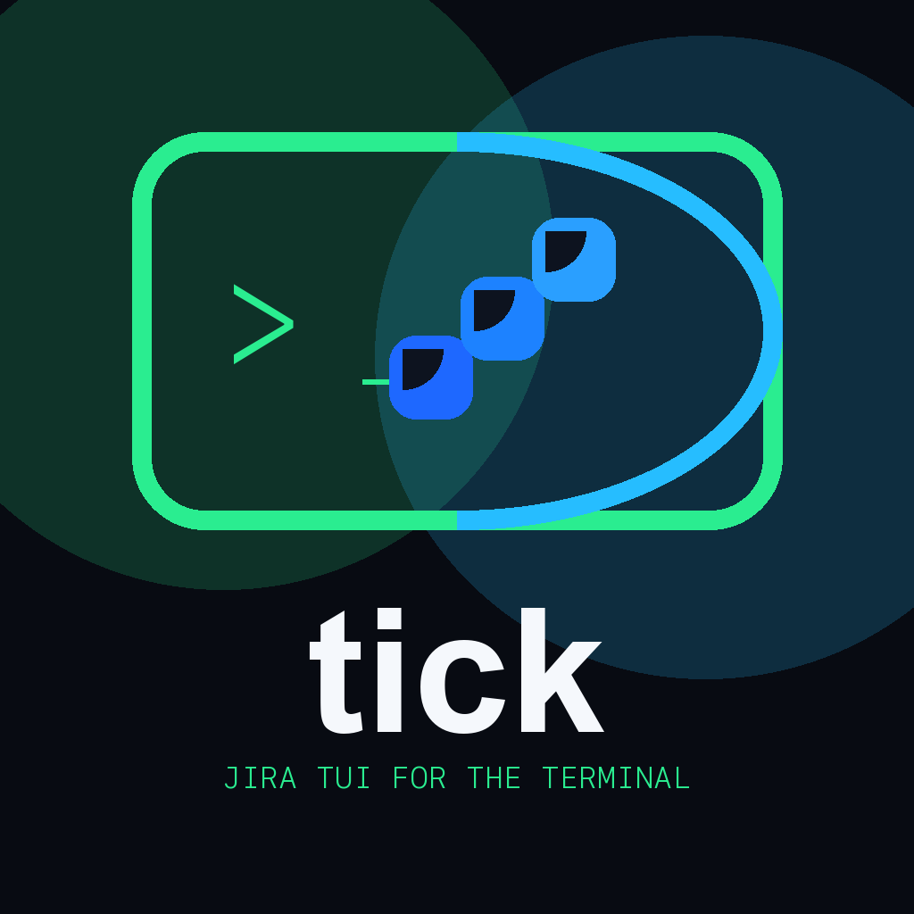
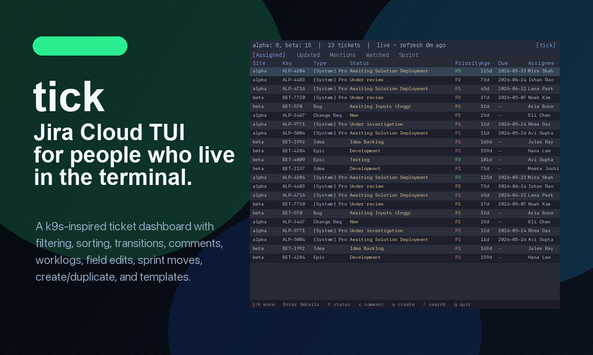

<p align="center">
  
</p>

<h1 align="center">tick</h1>

<p align="center">
  <strong>A k9s-inspired Jira Cloud TUI for your terminal.</strong><br />
  Multi-site inbox, keyboard-first triage, and write-back — without opening the browser.
</p>

<p align="center">
  <a href="https://www.producthunt.com/products/tick-4?launch=tick-4">
    
  </a>
</p>

<p align="center">
  <a href="https://www.producthunt.com/products/tick-4?launch=tick-4"><strong>We’re live on Product Hunt — your upvote helps →</strong></a>
  &nbsp;·&nbsp;
  <a href="https://github.com/aeswibon/tick/releases">Releases</a>
  &nbsp;·&nbsp;
  <a href="docs/USER_GUIDE.md">User guide</a>
  &nbsp;·&nbsp;
  <a href="LICENSE">MIT</a>
</p>

<p align="center">
  
</p>

---

## Why tick?

Jira’s web UI is powerful but slow for **daily triage**: too many clicks to move issues, comment, check mentions, or scan closed tickets. tick pulls your work into one **fast terminal dashboard** with vim-style keys, per-view caching, and direct API write-back.

## Features

| Area | What you get |
|------|----------------|
| **Inbox** | Six tabs — Assigned, Mentions, Watched, Updated, Sprint, **Closed** (JQL search) |
| **Multi-site** | Several `*.atlassian.net` instances in one table |
| **Triage** | Filter, sort, virtualized scroll, detail pane (summary / description / comments) |
| **Write-back** | Transitions, comments, worklogs, summary, priority, labels, description, sprint |
| **Create** | New (`n`), template (`N`), duplicate (`C`), export (`X`), manage templates (`Shift+E`) |
| **Views+** | Custom JQL tabs (`7`–`9`), Closed search persist, custom field columns |
| **Offline** | Per-view disk cache; `live` / `cached` / `offline` header |
| **Themes** | Built-in + custom TOML — [`themes/`](themes/) |

## Quick start

```bash
tick --init
# Token: TICK_TOKEN, ~/.config/tick/token, or config.toml — see docs/USER_GUIDE.md
tick --doctor
tick
```

Minimal `config.toml`:

```toml
email = "you@example.com"

[[sites]]
name = "my-team"
base_url = "https://my-team.atlassian.net"
```

## Install

| Method | Command |
|--------|---------|
| **GitHub Releases** | [Download binary](https://github.com/aeswibon/tick/releases) for macOS, Linux, Windows |
| **Homebrew** | `brew tap aeswibon/tick && brew install tick` |
| **From source** | `git clone https://github.com/aeswibon/tick.git && cd tick && cargo build --release` |

## Keybindings (essentials)

| Keys | Action |
|------|--------|
| `j` / `k`, `g` / `G`, `[` / `]` | Navigate / scroll |
| `1`–`6` | Assigned · Mentions · Watched · Updated · Sprint · Closed |
| `7`–`9`, `v` | Custom JQL views (config) |
| `/` | Filter (Closed: JQL search); `f` = local filter on Closed results |
| `Shift+E` | Edit/delete config templates |
| `Enter` | Detail pane (Links tab: jump to link/subtask) |
| `t` / `T`, `c`, `w` | Status transition, comment, worklog |
| `W` / `Shift+W` | Watch / unwatch issue |
| `d` (detail) | Edit due date |
| `I` (detail) | Add issue link (Links tab) |
| `n`, `N`, `C`, `X` | New · template · duplicate · export template |
| `?` | In-app help |

Full reference: [docs/KEYBINDINGS.md](docs/KEYBINDINGS.md)

## Documentation

| Guide | Description |
|-------|-------------|
| [docs/USER_GUIDE.md](docs/USER_GUIDE.md) | Setup and daily workflow |
| [docs/features/](docs/features/README.md) | Per-feature guides with examples |
| [docs/KEYBINDINGS.md](docs/KEYBINDINGS.md) | Complete keyboard map |
| [docs/CONFIGURATION.md](docs/CONFIGURATION.md) | `config.toml` reference |
| [CHANGELOG.md](CHANGELOG.md) | Version history |

## CLI

```bash
tick                      # Launch TUI
tick --init               # Create ~/.config/tick/config.toml
tick --doctor             # Test API, sprint fields, agile boards
tick auth login           # OAuth (optional)
tick --list-themes        # List themes
tick template export my-site HIN-1 -o templates/local.toml  # Export issue as template TOML
```

## Contributing

[CONTRIBUTING.md](CONTRIBUTING.md) · [Architecture](docs/architecture/README.md) · [GitHub Issues](https://github.com/aeswibon/tick/issues) · [CHANGELOG.md](CHANGELOG.md)

## License

MIT — [LICENSE](LICENSE)
