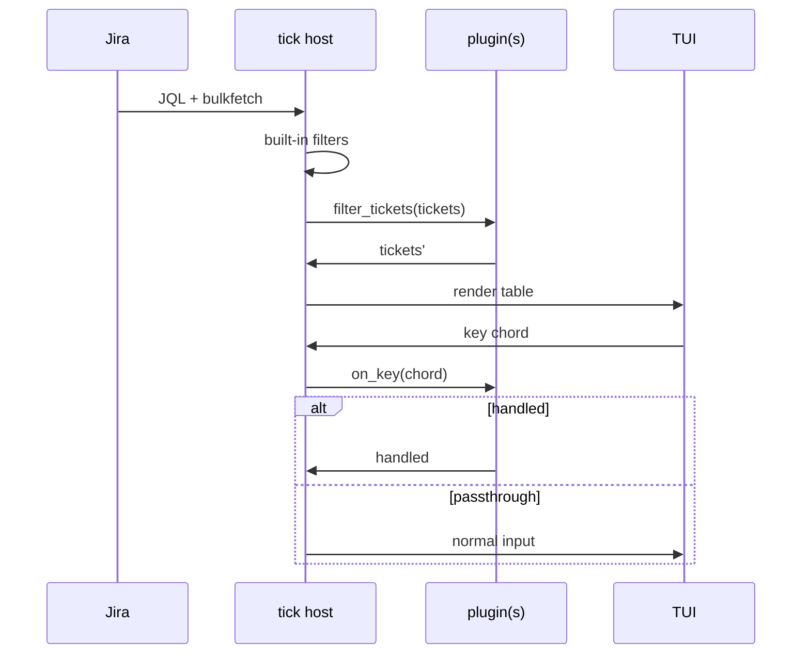

# RFC: tick plugin runtime (track C)

**Status:** C.1–C.3 implemented (v0.21–v0.23); C.4 (WASM) on demand  
**Authors:** tick maintainers  

## Summary

Introduce an optional **in-process plugin runtime** so power users can extend tick without forking the binary. Plugins run locally, with **no network access**, and delegate privileged operations (Jira writes) back to tick’s existing `api` core.

This document chooses between Lua and WebAssembly, defines a minimal API surface, sandbox rules, and extension points. It does **not** specify a plugin marketplace or remote distribution.

## Goals

| Goal | Notes |
|------|--------|
| Filter or decorate the ticket table | e.g. hide epics, highlight blockers |
| Register custom key chords | Complement config hooks and CLI |
| Read-only inspection | Access current view tickets as structured data |
| Safe failure | Bad plugin must not crash the TUI loop |
| Delegated writes | Transitions/comments go through `JiraClient`, not plugin HTTP |

## Non-goals

- Arbitrary HTTP/HTTPS from plugins
- Plugin marketplace or signed distribution (initially: user drops files in a config dir)
- Replacing `[[hooks.*]]` shell scripts (hooks stay the simple default)
- Jira Server / Data Center–specific plugin APIs
- Hot-reload of plugin code without restart (may come later)

## Background

Today tick offers:

1. **TUI + config** — views, columns, themes, editable fields  
2. **Headless CLI** — `tick search`, `tick issue`, `tick bulk`, `--format json`  
3. **Hooks** — `on_refresh`, `on_bulk_complete`, etc. (shell commands, JSON on disk)

Track **C** fills the gap: **low-latency, in-process** logic (filter rows, custom keys) without spawning a process per keypress or maintaining a separate daemon.

## Runtime options

### Option A — Lua (recommended for C.1)

| Pros | Cons |
|------|------|
| Mature Rust bindings (`mlua` / `rlua`) | Sandboxing is convention + API design, not hardware isolation |
| Small scripts, fast iteration | Users may expect full Lua stdlib unless explicitly denied |
| Easy data exchange with Rust (`Ticket` → table) | Single-threaded script; long scripts block unless yielded |
| Familiar to Neovim/Wireshark users | |

**Sandbox approach:** `mlua` with `Lua::unsafe_new()` avoided; use safe constructor, **no `require`**, no `io`/`os`/`debug`, no `package.loadlib`. Expose only a `tick` module table.

### Option B — WebAssembly (WASM)

| Pros | Cons |
|------|------|
| Strong memory isolation | Heavier dependency (`wasmtime` / `wasmer`) |
| Good for compiled plugins (Rust, Go) | Awkward for quick 20-line filters |
| Clear “no host syscalls” story | ABI versioning and marshalling more complex |

**Recommendation:** Ship **Lua first** (C.1–C.2). Revisit WASM if demand appears for compiled, untrusted third-party plugins.

## Plugin discovery

```text
~/.config/tick/plugins/
  my-filter/
    tick.plugin.toml   # manifest
    main.lua           # entry (Lua path)
```

### Manifest (`tick.plugin.toml`)

```toml
name = "my-filter"
version = "0.1.0"
api = "1"                    # tick plugin API version
runtime = "lua"
entry = "main.lua"

[capabilities]
filter_tickets = true
on_key = ["ctrl+shift+h"]
```

- **`api`** — tick rejects plugins with unsupported API versions (clear error at startup).
- **`capabilities`** — opt-in flags; host refuses undeclared hooks (principle of least privilege).

Load order: lexical directory name; later: explicit `plugins.enabled = ["a", "b"]` in `config.toml`.

## Host API (v1 sketch)

All functions receive a read-only **context** and return values validated by the host.

### `tick.version() -> string`

Plugin API version tick was built with.

### `tick.view() -> { name, mode, site_filter? }`

Active view metadata (no credentials).

### `tick.tickets() -> { { key, site, summary, status, ... }, ... }`

Snapshot of **current filtered table rows** (same shape as stable JSON export fields, not raw Jira ADF).

### `tick.filter_tickets(tickets) -> tickets`

Called after Jira fetch + built-in filters, before render. Plugin returns a new list (or the same table). Host enforces max length ≤ configured `max_results` aggregate.

### `tick.on_key(chord) -> "handled" | "passthrough"`

- Host calls plugins in load order until one returns `"handled"`.
- Unhandled chords fall through to existing `input::handle_key`.
- **No** raw terminal access from plugins.

### `tick.run_transition(key, transition_id) -> ok, err?` (C.3)

Delegates to existing transition pipeline (required fields, validation). Plugin cannot craft arbitrary REST bodies.

## Event flow



## Security model

| Threat | Mitigation |
|--------|------------|
| Credential exfiltration | No network, no filesystem APIs in Lua sandbox; no env access |
| Disk ransomware | No `io`/`os`; plugins cannot write outside host-invoked paths |
| TUI DoS | Per-call timeout (e.g. 50 ms); on timeout disable plugin + footer warning |
| Jira abuse | Writes only via `tick.run_transition` / future narrow APIs with same rate limits as UI |
| Supply chain | Document “only install plugins you trust”; no marketplace in v1 |

Plugins are **trusted code with restricted APIs**, not arbitrary code execution. Users who need full shell power should keep using `[[hooks.*]]`.

## Error handling

- Load error (syntax, bad manifest): log to stderr + footer once; skip plugin.
- Runtime error: catch at host boundary, show `plugin "name": <message>`, continue TUI.
- Panics in Rust bridge: isolate per plugin; never unwind across the main loop.

## Versioning

- **`api = "1"`** in manifest matches `tick::plugin::API_VERSION`.
- Breaking changes bump API; tick loads plugins with `api <= supported` only.
- Deprecated hooks remain for one minor release with warnings in `tick doctor`.

## Implementation phases

| Phase | Deliverable |
|-------|-------------|
| C.0 | This RFC + `tick doctor` stub listing plugin dir |
| C.1 | Load single Lua plugin; `filter_tickets` only |
| C.2 | `on_key` registration + chord parser shared with docs |
| C.3 | `run_transition` delegate + example in `examples/plugins/` |
| C.4 | Optional second runtime (WASM) if justified |

## Alternatives considered

1. **Hooks only** — Already shipped; insufficient for per-key table logic without process spawn latency.
2. **Python embedded** — Heavier runtime, harder sandbox than Lua.
3. **WASM-only** — Better isolation but worse ergonomics for v1.
4. **LSP / external daemon** — More flexible but conflicts with “single binary” distribution goal.

## Open questions

1. Should multiple plugins chain `filter_tickets` (pipeline) or merge (union/intersection policy)?
2. Should plugins access **detail pane** state (selected issue ADF) read-only?
3. Config reload (`R`): reload plugins or require restart?
4. Windows code-signing expectations for corporate laptops?

## References

- [product roadmap — automation ladder](../superpowers/specs/2026-05-30-product-and-automation-roadmap.md#c--plugin-runtime-months-814)
- [hooks feature guide](../features/automation-hooks.md)
- [architecture overview](README.md)
